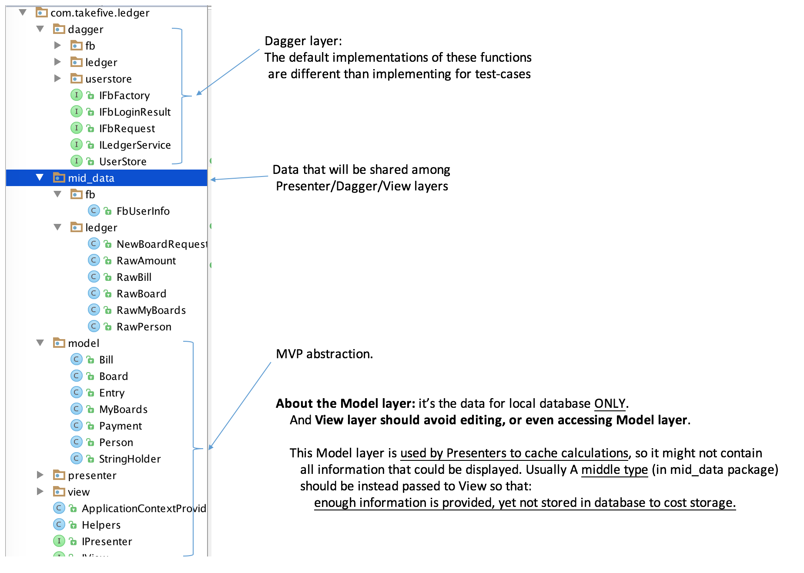

### Build requirements
You must have a debug key registered for Facebook Developement. Our groups share the same Facebook Developer account. You will need to specify the location of you debug key in ```local.properties```:
```
keys.ledgerGroupDebug=XXX
keys.ledgerGroupDebug.password=XXX
```

JDK 8, and Build tools with version precisely equal to "23.0.2" are required.

### Explannation of Package structure:


