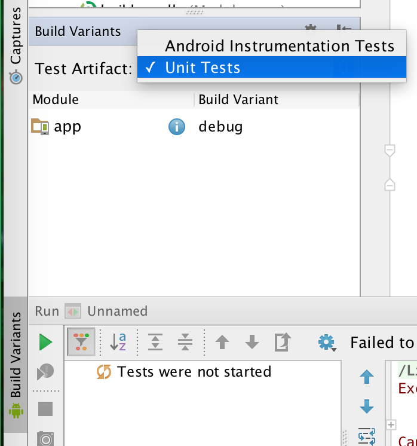

### Build requirements
You must have a debug key registered for Facebook Developement. Our groups share the same Facebook Developer account. You will need to specify the location of you debug key in ```local.properties```:
```
keys.ledgerGroupDebug=XXX
keys.ledgerGroupDebug.password=XXX
```

JDK 8, and Build tools with version precisely equal to "23.0.2" are required.

### Explanation of Package structure:


### JUnit HOW-TO:
We use JUnit testing system which is different from the default "Android Instrument" system. It enables testing without an Android device. However this requires changes of IDE Settings. Please change the settings for "Build Variants" in your Android Studio, as follows:



